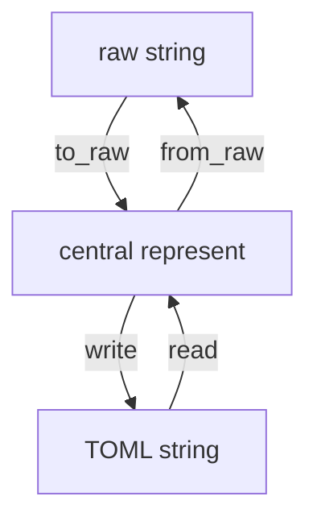

# esc-configdata-gen

Focus on EtherCAT Slave Controller Configuration Area (First 16bytes of SII) generation/explain only. 

## feature

* [x] ESC ConfigData generation
* [x] ESC ConfigData explain

## usage

For decode

```bash
esc-configdata-gen -d 050D08EE1027
```
output

```toml
sync_signal_pulse_length = 4135

[sync_signal_latch_mode]
latch1_map_to_al_request = true
latch1_to_sync1_config = true
sync1_out_driver_polarity = "push_pull_active_high"
latch0_map_to_al_request = true
latch0_to_sync0_config = true
sync0_out_driver_polarity = "push_pull_active_high"

[pdi_spi_config]
spi_data_out_sample_mode = "normal_sample"
spi_sel_polarity = "active_low"
spi_irq_driver_polarity = "push_pull_active_high"
spi_mode = "spi_mode_0"

[esc_config]
enhanced_link_port3 = false
enhanced_link_port2 = false
enhanced_link_port1 = false
enhanced_link_port0 = false
distibuted_clock_latch_in_enable = true
distibuted_clock_sync_out_enable = true
enhanced_link_detection_enable = false
al_status_reg_set_by_al_control = true

[pdi_control]
type = "spi"
```

For encode,
```bash
cat setting.toml | esc-configdata-gen -e
```

e.g.
```bash
esc-configdata-gen -d 050D08EE1027 | esc-configdata-gen -e
050D08EE1027
```

## overview


